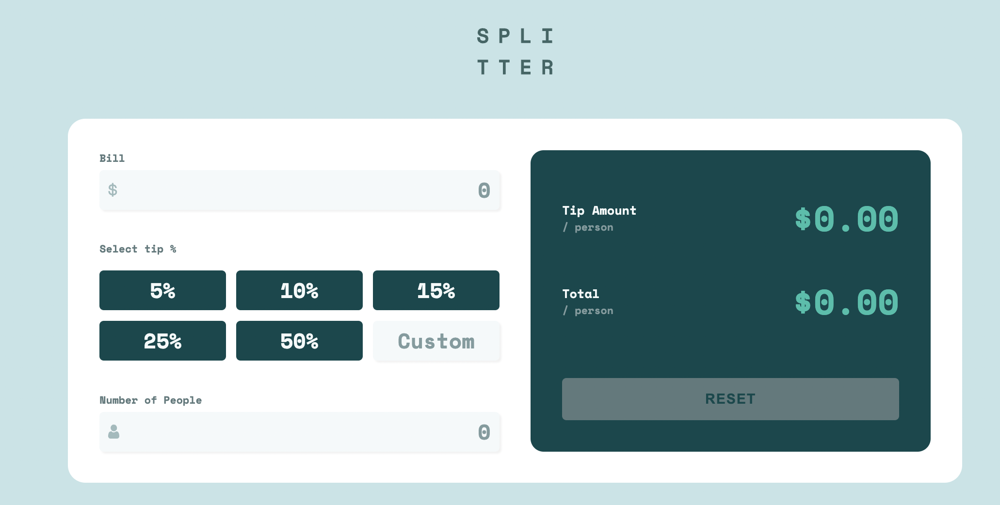
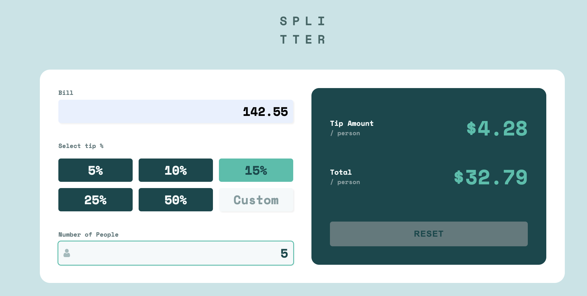
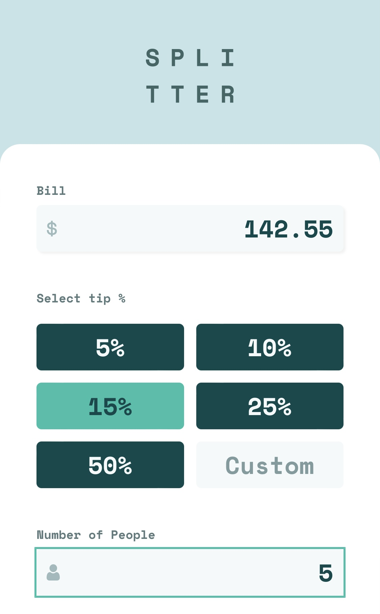
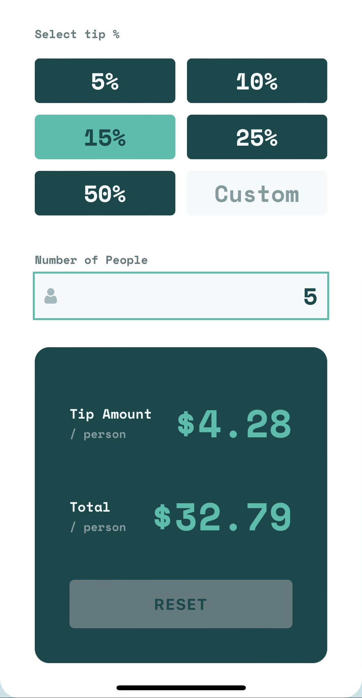

# Frontend Mentor - Tip calculator app solution

This is a solution to the [Tip calculator app challenge on Frontend Mentor](https://www.frontendmentor.io/challenges/tip-calculator-app-ugJNGbJUX). Frontend Mentor challenges help you improve your coding skills by building realistic projects.

## Table of contents

- [Overview](#overview)
  - [The challenge](#the-challenge)
  - [Screenshot](#screenshot)
  - [Links](#links)
- [My process](#my-process)
  - [Built with](#built-with)
  - [What I learned](#what-i-learned)
  - [Useful resources](#useful-resources)
- [Author](#author)
- [Acknowledgments](#acknowledgments)

## Overview

### The challenge

Users should be able to:

- View the optimal layout for the app depending on their device's screen size
- See hover states for all interactive elements on the page
- Calculate the correct tip and total cost of the bill per person

### Screenshot







### Links

- Solution URL: [https://github.com/YusufAkilevi/Tip-Calculator-App-Frontend-Mentor](https://github.com/YusufAkilevi/Tip-Calculator-App-Frontend-Mentor)
- Live Site URL: [https://tip-calculator-app-yakilevs.netlify.app/](https://tip-calculator-app-yakilevs.netlify.app/)

## My process

### Built with

- Semantic HTML5 markup
- CSS custom properties
- Flexbox
- CSS Grid
- Desktop-first workflow
- JavaScript

### What I learned

I learned to design the focus state of an element by using :focus pseudo element:

```css
.input:focus {
  outline: 2px solid hsl(172, 67%, 45%);
}
```

And also practice to design the placeholder of input elements:

```css
.input::placeholder {
  font-weight: 700;
  color: hsl(184, 14%, 56%);
  text-align: right;
}
```

I used CSS Grid with flexbox to create the layout and used JavaScript to give the website functionality.

### Useful resources

- [MDN](https://developer.mozilla.org/en-US/) - This helped me to find anything related Javascript, CSS or HTMl.
- [CSS Tricks](https://css-tricks.com/) - This website explains css properties really easy to understand and provide example codes.

## Author

- Frontend Mentor - [@YusufAkilevi](https://www.frontendmentor.io/profile/YusufAkilevi)
- Twitter - [@yusufakilevii](https://twitter.com/yusufakilevii)
- GitHub - [@YusufAkilevi](https://github.com/YusufAkilevi)

## Acknowledgments

I worked alone in this project and I hope I would have an opportunity to work on an open source project with other developers.
